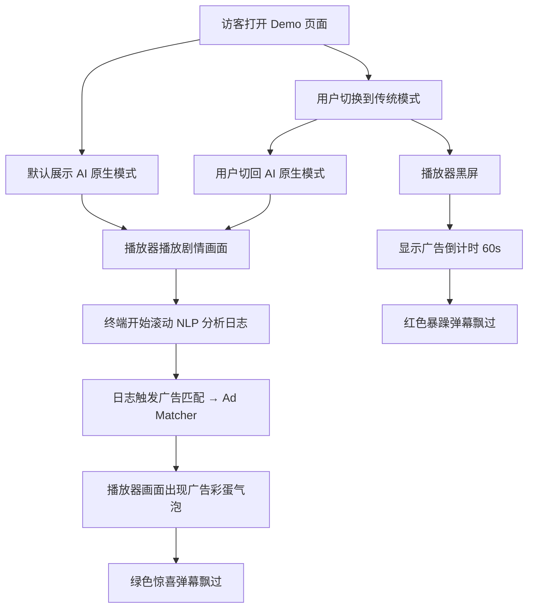

## 1. 产品概述

AdBlend 是一款基于多模态 AI 解析的无感原生广告系统演示 Demo，旨在参加"腾讯 PCG 校园 AI 产品创意大赛"。核心理念是颠覆传统视频插播广告，利用 AI 实时对视频流进行 NLP 情感分析和实体提取，在不打断正片播放的前提下，将广告作为"彩蛋"或互动元素无缝渲染在相关剧情画面中。

- **目标用户**：大赛评委、投资人、关注广告技术创新的人群
- **核心价值**：通过直观的 AB 对比演示，展现 AI 原生广告相比传统硬广的巨大体验优势

## 2. 核心功能

### 2.1 用户角色
本 Demo 无需用户登录，所有访客均可直接体验。

| 角色 | 说明 |
|------|------|
| 演示访客 | 浏览 Demo，切换 AB 模式对比广告体验差异 |

### 2.2 功能模块
1. **主演示页**：包含视频播放器模拟区、AI 终端日志区、AB 模式切换面板、弹幕模拟区

### 2.3 页面详情

| 页面名称 | 模块名称 | 功能描述 |
|----------|----------|----------|
| 主演示页 | AB 模式切换面板 | 醒目的 Toggle 开关，在"传统暴力插播模式"和"AdBlend AI 原生模式"间切换 |
| 主演示页 | 左侧视频播放器 | 模拟视频播放器外观，根据当前模式展示不同画面（黑屏广告倒计时 / 正常剧情播放 + AI 广告彩蛋） |
| 主演示页 | 右侧 AI 终端 | 黑框控制台风格，打字机效果滚动展示 AI 处理日志（NLP 实体提取、情感分析、广告匹配） |
| 主演示页 | 弹幕模拟层 | 覆盖在播放器上方，传统模式飘过红色暴躁弹幕，AI 模式飘过绿色惊喜弹幕 |
| 主演示页 | AI 广告彩蛋挂件 | 在 AI 模式下，当广告被触发时，在剧中人物举杯旁弹出半透明饮品广告气泡，带 fade-in + bounce 动效 |

## 3. 核心流程

## 4. 用户界面设计

### 4.1 设计风格
- **主色调**：深黑 (#0a0a0a) 底色，青色 (#00e5ff / cyan-400) 科技感主色，紫色 (#8b5cf6) 作为点缀
- **按钮风格**：半透明玻璃质感，圆角，hover 时发光边框
- **字体**：中文字体使用系统默认无衬线字体，英文字体使用 JetBrains Mono 用于终端展示
- **布局风格**：左右分栏式，左侧视频播放器占 60%，右侧终端占 40%
- **整体气质**：暗黑极客风，灵感来源于腾讯视频网页版 + 高级数据中台终端

### 4.2 页面设计概览

| 页面名称 | 模块名称 | UI 元素 |
|----------|----------|---------|
| 主演示页 | AB 模式切换面板 | 居中置顶，大号 Toggle 滑块，青色高亮当前选中模式，带 glow 光晕动画 |
| 主演示页 | 左侧视频播放器 | 16:9 比例深色容器，圆角边框，半透明渐变遮罩，播放控制条（装饰），16:9 剧照场景 |
| 主演示页 | 右侧 AI 终端 | 纯黑底 + 绿色/青色等宽字体日志，顶部有标题栏和红黄绿三色圆点装饰，打字机逐字打印效果 |
| 主演示页 | 弹幕层 | 绝对定位覆盖在播放器上方，文字从右向左飘过，不同颜色区分传统/ AI 模式 |
| 主演示页 | 广告彩蛋挂件 | 绝对定位在播放器画面特定位置，玻璃拟态卡片，带商品图标和文案，fade-in + bounce-in 入场动画 |

### 4.3 响应式设计
- 桌面端（≥1024px）：左右分栏布局
- 平板端（768-1023px）：上下堆叠布局，视频在上终端在下
- 手机端（<768px）：单列布局，Toggle 缩小，终端字体缩小

## 5. 数据与状态

### 5.1 Mock 数据
- 终端日志：预设 8-10 条 NLP 分析日志序列，每条日志有固定的延迟时间模拟 AI 计算过程
- 弹幕数据：传统模式预设 6 条红色暴躁弹幕，AI 模式预设 6 条绿色惊喜弹幕
- 广告数据：预设 1 个广告商品（气泡水），包含名称、文案、图片描述

### 5.2 状态管理
- 使用 React 内置 state（useState/useReducer）管理 AB 模式切换状态、日志播放进度、弹幕播放状态
