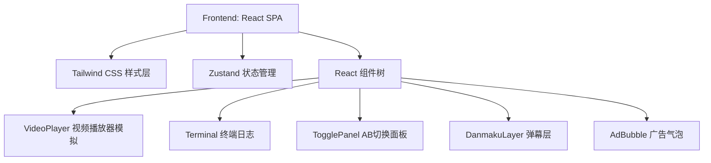
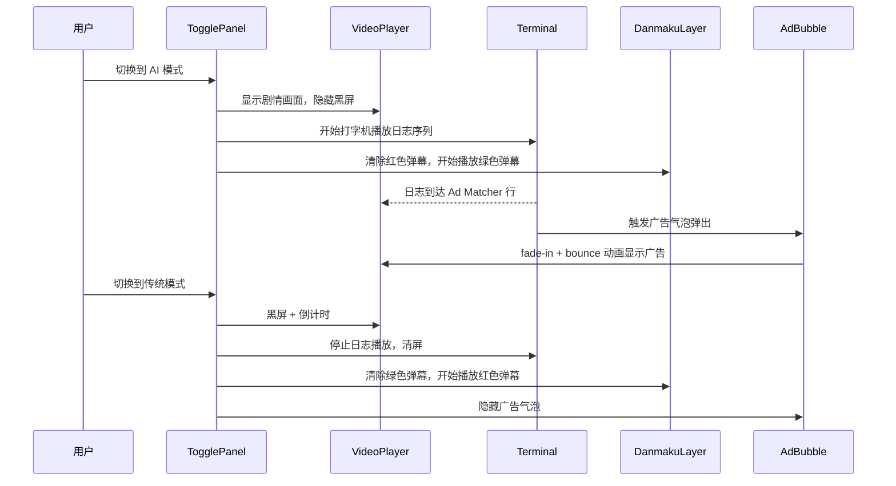

## 1. 架构设计



本 Demo 为纯前端项目，无后端和数据库，所有数据均为 Mock 数据。

## 2. 技术选型

- **前端框架**：React@18 + TypeScript
- **样式方案**：Tailwind CSS@3
- **状态管理**：React useState + useReducer（轻量场景无需 Zustand）
- **构建工具**：Vite@5
- **图标库**：lucide-react
- **项目模板**：react-ts (Vite + React + TypeScript + Tailwind + Zustand)

## 3. 路由定义

| 路由 | 用途 |
|------|------|
| / | 主演示页，包含所有功能模块 |

## 4. 组件结构

```
src/
├── App.tsx                    # 根组件，协调所有子组件
├── main.tsx                   # 入口文件
├── index.css                  # Tailwind 指令 + 自定义全局样式 + 字体
├── components/
│   ├── TogglePanel.tsx        # AB 模式切换面板
│   ├── VideoPlayer.tsx        # 模拟视频播放器
│   ├── Terminal.tsx           # AI 终端日志滚动
│   ├── DanmakuLayer.tsx       # 弹幕模拟层
│   └── AdBubble.tsx           # AI 广告彩蛋气泡挂件
├── hooks/
│   ├── useTypewriter.ts       # 打字机效果 hook
│   └── useDanmaku.ts          # 弹幕生成与动画 hook
├── data/
│   ├── terminalLogs.ts        # 终端日志 Mock 数据
│   └── danmaku.ts            # 弹幕 Mock 数据
└── types/
    └── index.ts               # 公共类型定义
```

## 5. 数据模型

### 5.1 类型定义

```typescript
// 终端日志条目
interface LogEntry {
  id: number;
  prefix: string;    // 如 "[System]", "[NLP Engine]"
  message: string;
  delay: number;     // 模拟 AI 处理延迟（ms）
}

// 弹幕条目
interface DanmakuItem {
  id: string;
  text: string;
  mode: 'traditional' | 'ai';
  delay: number;      // 出场延迟
  speed: number;      // 飘过速度
  top: number;        // 垂直位置百分比
}

// AB 模式
type AdMode = 'traditional' | 'ai';

// 广告信息
interface AdInfo {
  id: string;
  name: string;
  tagline: string;
  icon: string;       // emoji
}
```

## 6. 关键交互时序


